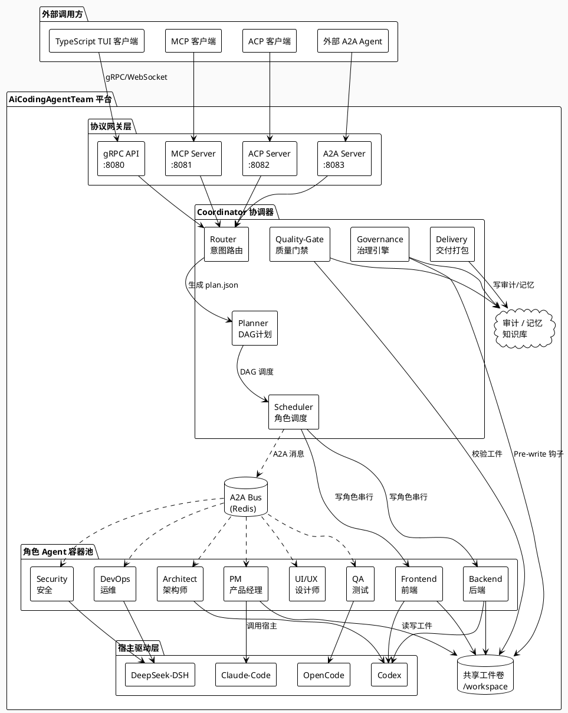
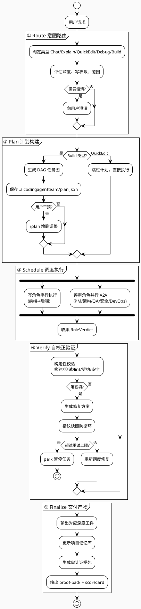
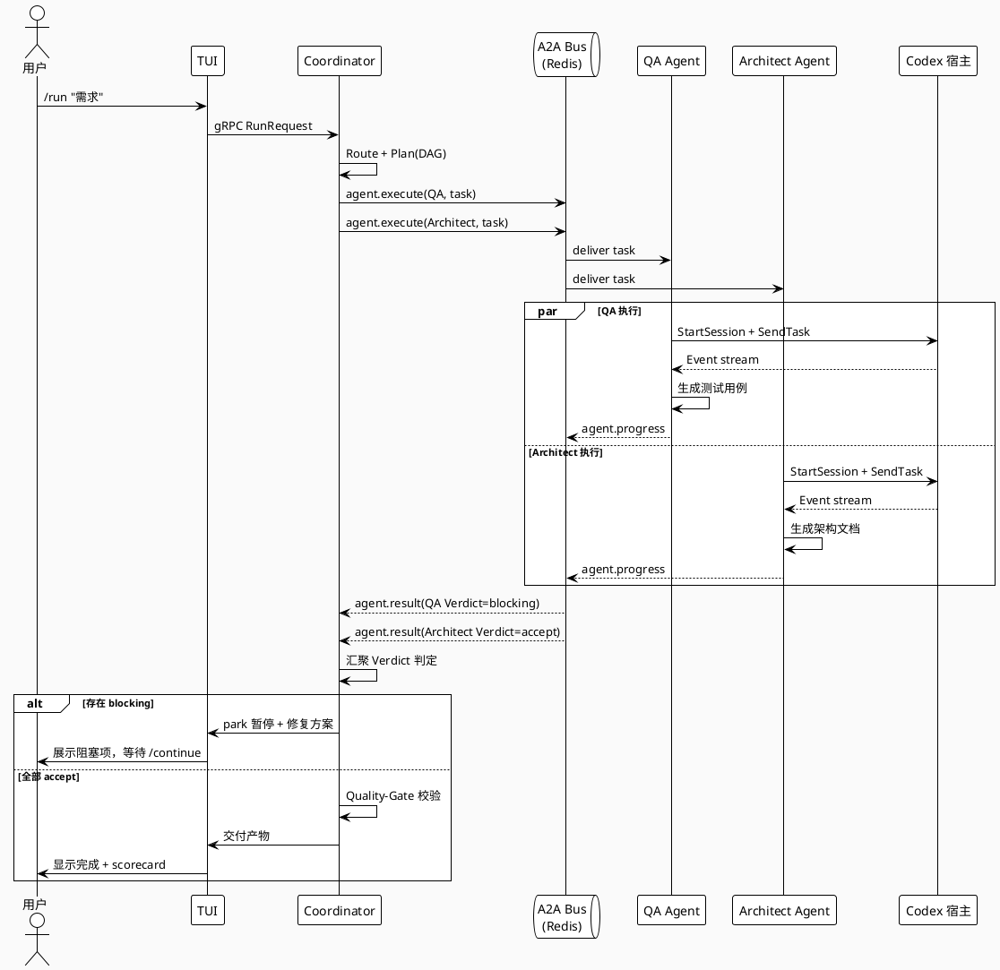
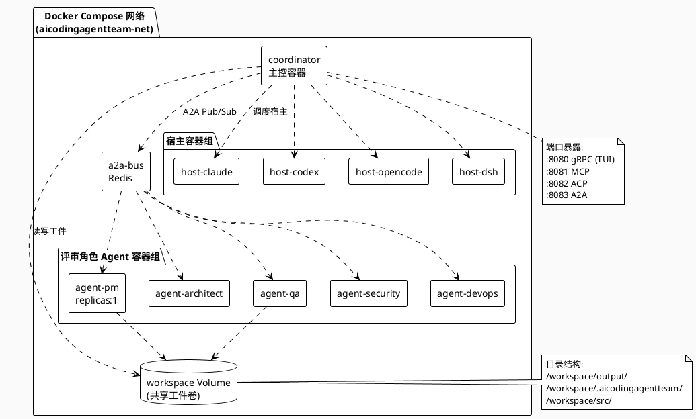
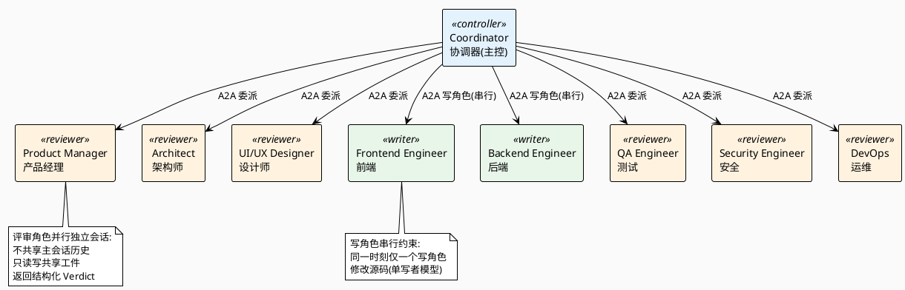

# 系统架构图 — AiCodingAgentTeam

> 项目名称：AiCodingAgentTeam
> 文档版本：v1.0
> 编写日期：2026-09-02
> 关联文档：02-技术架构设计.md

本文档提供 PlantUML 源码，可粘贴到 [PlantUML 在线编辑器](https://www.plantuml.com/plantuml/uml/) 渲染，或本地 `plantuml` 命令生成图片。

---

## 1. 高层架构总览图

---

## 2. 五层执行流转图

---

## 3. A2A 协作时序图

---

## 4. 容器化部署拓扑图

---

## 5. 九角色编排模型图

